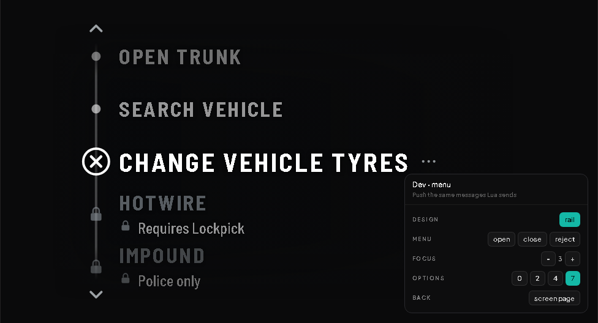
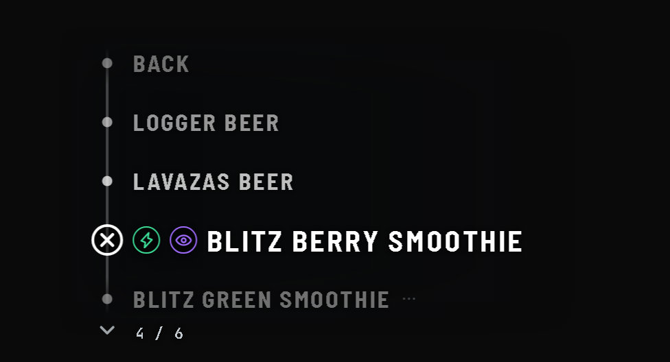
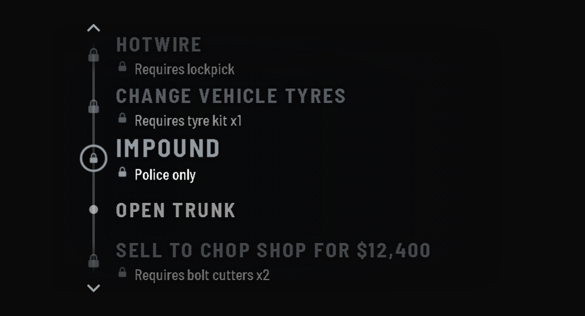
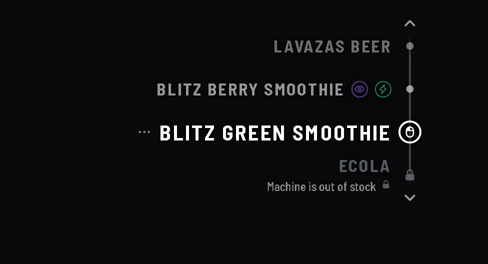
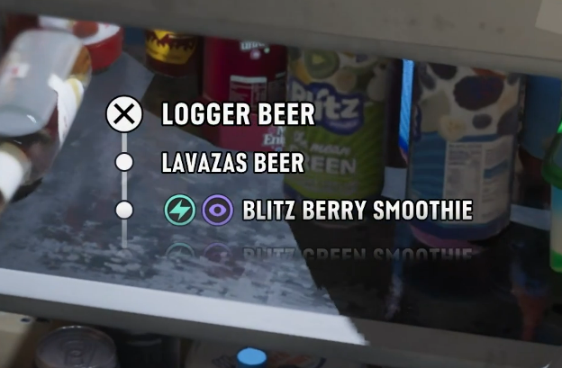
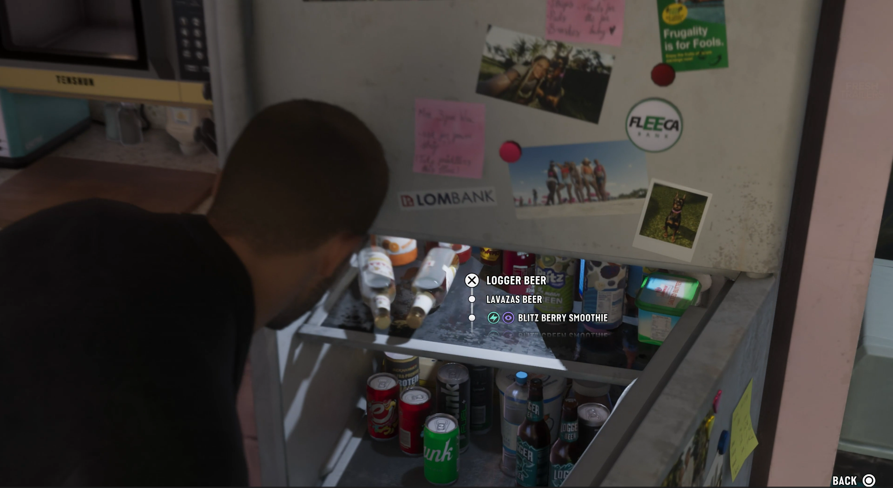
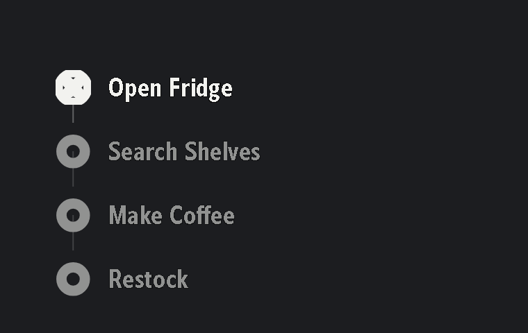

# osm-target (GTA VI-style fork)

[](LICENSE)

> **Modified fork notice.** This repository is a modified derivative work of
> [`osm-target`](https://github.com/OsmFX-Mods/osm-target) by **OsmFX Mods**,
> licensed under the [OsmFX Mods Source-Available License v1.0](LICENSE). It
> is not an official, endorsed, or supported release of OsmFX Mods — for the
> original script and official support, see **https://osmfxmods.com/**. OsmFX
> Mods also separately sells a commercial "Target VI" design pack at
> [osmfxmods.com/product/7667144](https://www.osmfxmods.com/product/7667144),
> which is a different product from this fork's `Context Rail` design pack
> (see below).
>
> The bundled `Context Rail` design pack was designed by **Geckomacabre**,
> with the assistance of Claude (Anthropic), with reference to Rockstar
> Games' own footage — *Grand Theft Auto VI: An Extended Look* — not to
> OsmFX Mods' commercial "Target VI" design pack. See the reference
> screenshots below, taken from that Rockstar footage, and the **Proof of
> independent origin** section further down for dated, public prior art.

A modern, world-space DUI targeting and interaction framework for FiveM. Unlike traditional screen-space target scripts, `osm-target` projects interactive surfaces directly onto entities in 3D world space with depth perception, intuitive requirement explanations, and complete drop-in compatibility for existing `ox_target`, `qb-target`, and `qtarget` scripts.

---

## Interface Design — Context Rail

This fork ships one design, **Context Rail**, and it is the only one installed. Every setting below is retuned live in `/targetadmin` and saved to the database — no resource restart. Further packs can be authored against the SDK and dropped into `designs/`; the admin panel lists whatever it finds.

<table>
<tr>
<td width="50%"></td>
<td width="50%"></td>
</tr>
<tr>
<td width="50%"></td>
<td width="50%"></td>
</tr>
</table>

- **Rail Pinned To The Entity**: A vertical rail drawn straight onto the world with no panel behind it. The focused node sits exactly on the point the player is aimed at.
- **Reads As Gated At A Glance**: An ineligible row swaps its node for a padlock and prints its requirement underneath, without the player scrolling onto it first.
- **Scroll Behaviour You Pick**: Park the focus on the entity and slide the list past it, or hold the rows still and walk the focus down them.
- **Condensed And Legible**: Condensed typography with a tunable scrim and contrast keyline behind every glyph.
- **Fully Customizable**: Side, row count, spacing, confirm glyph, typeface, colors and motion — all live in the admin panel.

Build your own design packs with the React + TypeScript SDK — see [docs/design-packs.md](docs/design-packs.md).

**Reference.** The rail concept above was modeled on Rockstar Games' own interaction UI in *Grand Theft Auto VI* (screenshots are Rockstar's, shown here for design-reference/commentary purposes only — no game assets are included in this resource):

<table>
<tr>
<td width="50%"></td>
<td width="50%"></td>
</tr>
</table>

### Proof of independent origin

`Context Rail` (`designs/rail/design.lua`) was first committed to this repository on
**2026-09-12** ([`7c81eed9`](https://github.com/Geckomacabre/osm-target/commit/7c81eed9)).
Public, dated commits predating it by up to sixteen days show this author already
building GTA VI/RDR2-referenced interaction UI — including the specific rail/dot
mechanic itself, not just general GTA VI styling — independently of this fork
and of OsmFX Mods' "Target VI" pack:

- **2026-08-27** — [`3fde643a`](https://github.com/Geckomacabre/GTA-VI-UI-and-HUD-for-FiveM/commit/3fde643a),
  "Initial bundle: GTA VI-themed resources" — includes a GTA VI-styled reskin of
  `ox_target`'s own menu (`patches/ox_target/web/vice-theme.css`), with a plate
  material sampled from reference footage and a custom GTA Art Deco typeface.
- **2026-08-31** (`1c427e1a`) — this author's `vice_hud` resource ships a
  working `#interact` component implementing the same rail mechanic as
  `Context Rail`: `html/style.css` draws "a line from THIS marker's centre
  down to the next row's, so it reads as one continuous connector rather than
  floating dots," with an X-in-circle marker on the focused row and a hollow
  dot on every other row, exactly as `Context Rail`'s `confirmGlyph`/
  `railStyle` options do. `html/index.html` documents this explicitly as
  "Visual language: a vertical rail connects each row's marker dot... styled
  off the reference's scrollable item-select screen (the fridge frame)" —
  twelve days before `Context Rail` was ever committed to this repository.
  Rendered directly from that unmodified source (real markup, real CSS, real
  typeface — Belle Sans Extra Condensed Bold, per `style.css`'s own comment):

  

- **2026-09-05** (`c2e4a602`, "ox_target: always-on GTA VI/RDR2-style prompt
  via vice_hud, mz_textui skin") and **2026-09-10** (`fdcb7ac7`, `d6d2b4af`) —
  further vice_hud/ox_target GTA VI-styling work. These three commits live in
  this author's private multi-resource server repository and are available
  on request; they are not linked here since that repository isn't public.

OsmFX Mods' own Target VI product page
([osmfxmods.com/product/7667144](https://www.osmfxmods.com/product/7667144))
states that Target VI "takes its cue from the interaction style shown in
GTA VI's Extended Look" and that "every asset in the pack was drawn for it" —
the same public Rockstar Games trailer cited above, not a source original to
OsmFX Mods. Their own "Opening a fridge" demo clip on that page is drawn from
the identical scene as the reference screenshots above (same items visible:
"MACK," "Logger Beer," "Lavazas Beer," "Blitz Berry Smoothie"). Both this
design pack and OsmFX Mods' own commercial pack independently reference the
same publicly available footage.

**Author's statement.** `Context Rail`'s current version was built from this
author's own pre-existing `vice_hud` `#interact` rail component (above) and
the *Grand Theft Auto VI: An Extended Look* reference screenshots earlier in
this document — no part of OsmFX Mods' "Target VI" design pack was used as a
source, referenced, or included in building this repository. All code in
this design pack was generated with Claude Code (Anthropic).

These are reskins of `ox_target`'s own stock row-list menu, not the vertical
rail/dot layout itself — offered here as evidence of this author's ongoing,
independently dated GTA VI-referenced interaction-design work, not as a claim
that the rail mechanic specifically existed before this fork.

---

## What Makes osm-target Different?

Targeting scripts have been a staple of FiveM roleplay for years, but traditional solutions often come with immersion and clarity trade-offs. Here is how `osm-target` takes interaction to the next level:

- **True World-Space DUI & Magnetization vs Screen-Space Crosshairs**: Traditional targeting systems draw a static 2D icon in the center of your screen and pin option menus flat to your display. `osm-target` projects dynamic DUI surfaces anchored to the entity's actual coordinates in 3D game space with intelligent magnetic cursor snapping. Menus scale with distance and stay attached to the object, preserving immersion.
- **Clear Requirement Explanations vs Silent Failures**: When a player cannot perform an interaction, older target scripts either hide the option entirely or display an unclickable gray row without context. `osm-target` features a declarative requirement engine that tells players *why* an interaction is locked (e.g., *"Requires Lockpick"*, *"Police Only"*, *"Engine Must Be Off"*).
- **Decoupled Presentation Layer**: The interface is not hardcoded into the targeting logic. It is a design pack discovered from `designs/` at startup, so the look can be retuned — or replaced with a pack you author yourself — without touching a line of script code.
- **100% Drop-In Compatibility**: Zero script rewrites. Comprehensive built-in adapters provide full backwards compatibility with `ox_target`, `qb-target`, and `qtarget` exports and event structures.
- **Live Database-Backed Administration**: Fine-tune targeting angles, raycast ranges, timings, and visual tunables in real-time with `/targetadmin`. Changes persist to MySQL without server restarts.

---

## Quickstart Guide

### Prerequisites
- [ox_lib](https://github.com/overextended/ox_lib) (Required)
- [oxmysql](https://github.com/overextended/oxmysql) (Optional, required for SQL-backed `/targetadmin` persistence)

### Installation
1. Download the latest release package from the [Releases](https://github.com/Geckomacabre/osm-target/releases) page.
2. Extract the `osm-target` folder into your server's `resources` directory.
3. Ensure `ox_lib` (and `oxmysql` if used) starts before `osm-target` in your `server.cfg`:
   ```cfg
   ensure ox_lib
   ensure oxmysql
   ensure osm-target
   ```
4. Adjust initial settings in `config.lua` if desired.
5. Start your server and explore!

---

## Commands & Controls

| Command / Control | Description | Permission |
| :--- | :--- | :--- |
| `Left Alt` (default) | Hold or toggle targeting mode (configurable in `config.lua`). | All Players |
| `/targetui` | Opens personal accessibility preferences (scale, volume, reduced motion). | All Players |
| `/targetadmin` | Opens in-game administrative dashboard to tune targeting and designs. | Ace: `osm_target.admin` |

---

## Compatibility

`osm-target` is designed as a direct drop-in replacement for:
- **ox_target**: `exports.ox_target:...`
- **qb-target**: `exports['qb-target']:...`
- **qtarget**: `exports.qtarget:...`

No modifications to your existing jobs, vehicle systems, or community resources are required. Existing options are automatically translated and rendered within the world-space UI.

For full API documentation and migration details, consult [docs/compatibility.md](docs/compatibility.md) and [docs/api.md](docs/api.md).

---

## Documentation

- [docs/api.md](docs/api.md) — Comprehensive exports, option declarations, and event payload documentation.
- [docs/architecture.md](docs/architecture.md) — Under-the-hood breakdown of targeting logic, DUI surfaces, and pure state resolvers.
- [docs/compatibility.md](docs/compatibility.md) — Drop-in compatibility specifications for `ox_target`, `qb-target`, and `qtarget`.
- [docs/configuration.md](docs/configuration.md) — Configuration guide for static settings and the in-game admin panel.
- [docs/design-packs.md](docs/design-packs.md) — Architecture guide for creating, packaging, and loading custom design packs.
- [docs/development.md](docs/development.md) — UI development setup, build pipelines, and testing harnesses.

---

## License & Commercial Usage

Released under the **OsmFX Mods Source-Available License v1.0**.

- **Free for Server Use**: Free to use on any FiveM server, including monetized servers (VIP tiers, donations, Tebex perks).
- **No Reselling or Bundling**: You may not sell, sublicense, or bundle this script into paid products or on any marketplace.

Read the full [LICENSE](LICENSE) for details.

---

## Credits & AI Attribution

- **Base script**: [`osm-target`](https://osmfxmods.com/) by **OsmFX Mods** — this repository is a modified fork of their work, used under the OsmFX Mods Source-Available License v1.0. For the original, official releases, and support, see https://osmfxmods.com/.
- **Design reference**: The `Context Rail` interface is modeled on Rockstar Games' in-game interaction UI from *Grand Theft Auto VI*.
- Concept and Framework adapters: `ox_target` (formerly `qtarget`) and `qb-target`.

---

*Built on excessive caffeine, sleep deprivation, and generous inputs from our AI overlords Claude and Gemini; the bugs are proudly 100% human-made.*
