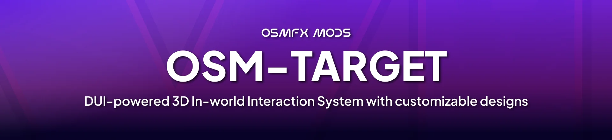
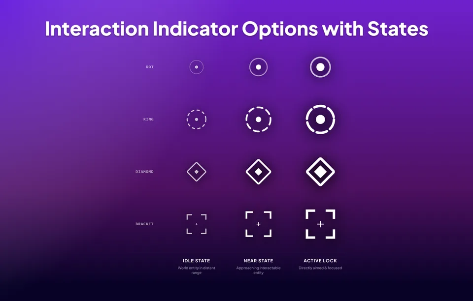
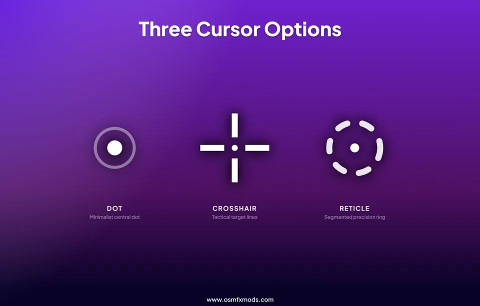
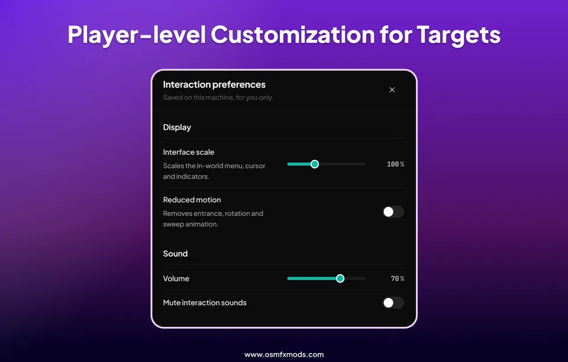
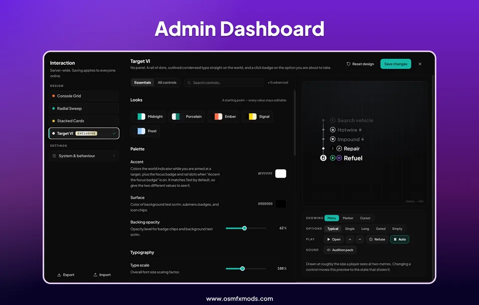

# OsmFX Mods Target - World-Space DUI Targeting System


[](https://osmfxmods.com)
[](https://www.osmfxmods.com/discord)
[](LICENSE)

A modern, world-space DUI targeting and interaction framework for FiveM. Unlike traditional screen-space target scripts, `osm-target` projects interactive surfaces directly onto entities in 3D world space with depth perception, intuitive requirement explanations, and complete drop-in compatibility for existing `ox_target`, `qb-target`, and `qtarget` scripts.

[](https://youtu.be/5qNmRHqkjO4)

<sub>*Video demonstrates features; the design pack shown in the video is available on our [website](https://osmfxmods.com).*</sub>

> **Pro Tip:** Elevate your server's experience with more premium resources and exclusive design packs at [OsmFX Mods](https://osmfxmods.com). Join our [Discord](https://www.osmfxmods.com/discord) for exclusive updates, announcements, and support!

---

## What Makes osm-target Different?

Targeting scripts have been a staple of FiveM roleplay for years, but traditional solutions often come with immersion and clarity trade-offs. Here is how `osm-target` takes interaction to the next level:

- **True World-Space DUI & Magnetization vs Screen-Space Crosshairs**: Traditional targeting systems draw a static 2D icon in the center of your screen and pin option menus flat to your display. `osm-target` projects dynamic DUI surfaces anchored to the entity's actual coordinates in 3D game space with intelligent magnetic cursor snapping. Menus scale with distance and stay attached to the object, preserving immersion.
- **Clear Requirement Explanations vs Silent Failures**: When a player cannot perform an interaction, older target scripts either hide the option entirely or display an unclickable gray row without context. `osm-target` features a declarative requirement engine that tells players *why* an interaction is locked (e.g., *"Requires Lockpick"*, *"Police Only"*, *"Engine Must Be Off"*).
- **Modular Hot-Swappable Design Packs**: Instead of being locked into a single hardcoded UI layout, `osm-target` completely decouples the presentation layer. The interface is powered by modular design packs that can be swapped live without restarting resources or modifying script code.
- **100% Drop-In Compatibility**: Zero script rewrites. Comprehensive built-in adapters provide full backwards compatibility with `ox_target`, `qb-target`, and `qtarget` exports and event structures.
- **Live Database-Backed Administration**: Fine-tune targeting angles, raycast ranges, timings, and visual tunables in real-time with `/targetadmin`. Changes persist to MySQL without server restarts.

---

## Interface Designs

Designs are hot-swappable packs. Switch and retune them live in `/targetadmin` — no restarts.

<table>
<tr>
<td width="45%">
  <video src="https://github.com/user-attachments/assets/e8aaf0d9-00dd-4d3b-89c8-072979fc29bf" width="100%" autoplay loop muted playsinline controls>
    <a href="https://github.com/user-attachments/assets/e8aaf0d9-00dd-4d3b-89c8-072979fc29bf">Watch Radial Sweep demo</a>
  </video>

</td>
<td width="55%">

### Radial Sweep — *Included Free*
The flagship open-source design, shipped in the box.
- **Fluid Radial Menu**: Sleek circular wheel with dynamic cursor tracking and subtle magnetic snapping.
- **Contextual Distance Scaling**: World-space indicator that expands as you approach interactable entities.
- **Detailed Badges & Submenus**: Clear visual cues for nested menus and item/job requirements.
- **Fully Customizable**: Adjust colors, opacity, typography, and corner radius live in the admin panel.

</td>
</tr>
<tr>
<td width="45%">
  <video src="https://github.com/user-attachments/assets/d17948f6-95ba-48a0-aa87-d641c7d4fff2" width="100%" autoplay loop muted playsinline controls>
    <a href="https://github.com/user-attachments/assets/d17948f6-95ba-48a0-aa87-d641c7d4fff2">Watch Target VI demo</a>
  </video>
</td>
<td width="55%">

### Target VI — *Premium Pack*
A clean, minimal list interface built for fast readability and quick interaction.
- **Colorful Item Badges**: Supports vibrant colored tags and labels to highlight prices, item types, or specific actions.
- **Mouse Click Prompts**: Option to display mouse click icons and clear input hints right next to active options.
- **Lightweight Rail Layout**: Unobtrusive dot indicator and smooth row focus that keeps the screen clear.
- **Available now** at [osmfxmods.com](https://osmfxmods.com) and our [Discord](https://www.osmfxmods.com/discord).

</td>
</tr>
</table>

### More Designs & Custom Packs
Additional premium design packs will be released on [osmfxmods.com](https://osmfxmods.com). You can also build your own bespoke design packs using our modern React + TypeScript SDK. See [docs/design-packs.md](docs/design-packs.md) for full instructions.

---

## Quickstart Guide

### Prerequisites
- [ox_lib](https://github.com/overextended/ox_lib) (Required)
- [oxmysql](https://github.com/overextended/oxmysql) (Optional, required for SQL-backed `/targetadmin` persistence)

### Installation
1. Download the latest release package from the [Releases](https://github.com/OsmFX-Mods/osm-target/releases) page.
2. Extract the `osm-target` folder into your server's `resources` directory.
3. Ensure `ox_lib` (and `oxmysql` if used) starts before `osm-target` in your `server.cfg`:
   ```cfg
   ensure ox_lib
   ensure oxmysql
   ensure osm-target
   ```
4. Adjust initial settings in `config.lua` if desired.
5. Start your server and explore!

---

## Commands & Controls

| Command / Control | Description | Permission |
| :--- | :--- | :--- |
| `Left Alt` (default) | Hold or toggle targeting mode (configurable in `config.lua`). | All Players |
| `/targetui` | Opens personal accessibility preferences (scale, volume, reduced motion). | All Players |
| `/targetadmin` | Opens in-game administrative dashboard to tune targeting and designs. | Ace: `osm_target.admin` |

---

## Compatibility

`osm-target` is designed as a direct drop-in replacement for:
- **ox_target**: `exports.ox_target:...`
- **qb-target**: `exports['qb-target']:...`
- **qtarget**: `exports.qtarget:...`

No modifications to your existing jobs, vehicle systems, or community resources are required. Existing options are automatically translated and rendered within the world-space UI.

For full API documentation and migration details, consult [docs/compatibility.md](docs/compatibility.md) and [docs/api.md](docs/api.md).

---

## Documentation

- [docs/api.md](docs/api.md) — Comprehensive exports, option declarations, and event payload documentation.
- [docs/architecture.md](docs/architecture.md) — Under-the-hood breakdown of targeting logic, DUI surfaces, and pure state resolvers.
- [docs/compatibility.md](docs/compatibility.md) — Drop-in compatibility specifications for `ox_target`, `qb-target`, and `qtarget`.
- [docs/configuration.md](docs/configuration.md) — Configuration guide for static settings and the in-game admin panel.
- [docs/design-packs.md](docs/design-packs.md) — Architecture guide for creating, packaging, and loading custom design packs.
- [docs/development.md](docs/development.md) — UI development setup, build pipelines, and testing harnesses.

---

## License & Commercial Usage

Released under the **OsmFX Mods Source-Available License v1.0**.

- **Free for Server Use**: Free to use on any FiveM server, including monetized servers (VIP tiers, donations, Tebex perks).
- **No Reselling or Bundling**: You may not sell, sublicense, or bundle this script into paid products or on any marketplace.

For commercial partnerships or creator permissions, join our [Discord](https://www.osmfxmods.com/discord). Read the full [LICENSE](LICENSE) for details.

*Small and Medium-sized Creators can get free commercial licenses from my Discord, and create and monetize Design Packs.*

---

<table>
  <tr>
    <td width="50%"></td>
    <td width="50%"></td>
  </tr>
  <tr>
    <td width="50%"></td>
    <td width="50%"></td>
  </tr>
</table>

---

## Credits & AI Attribution

- Concept and Framework adapters: `ox_target` (formerly `qtarget`) and `qb-target`.

---

*Built on excessive caffeine, sleep deprivation, and generous inputs from our AI overlords Claude and Gemini; the bugs are proudly 100% human-made.*
